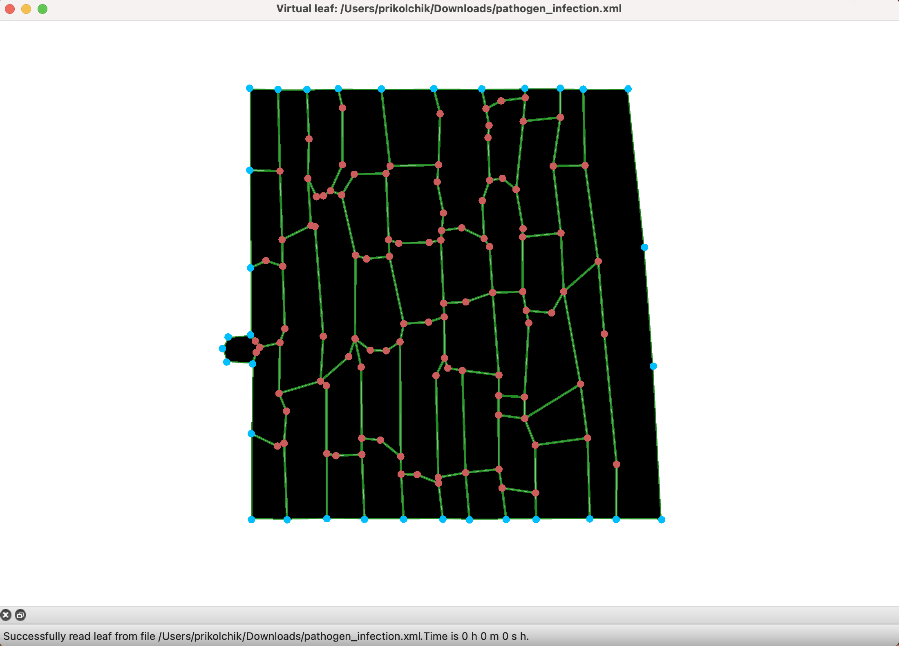
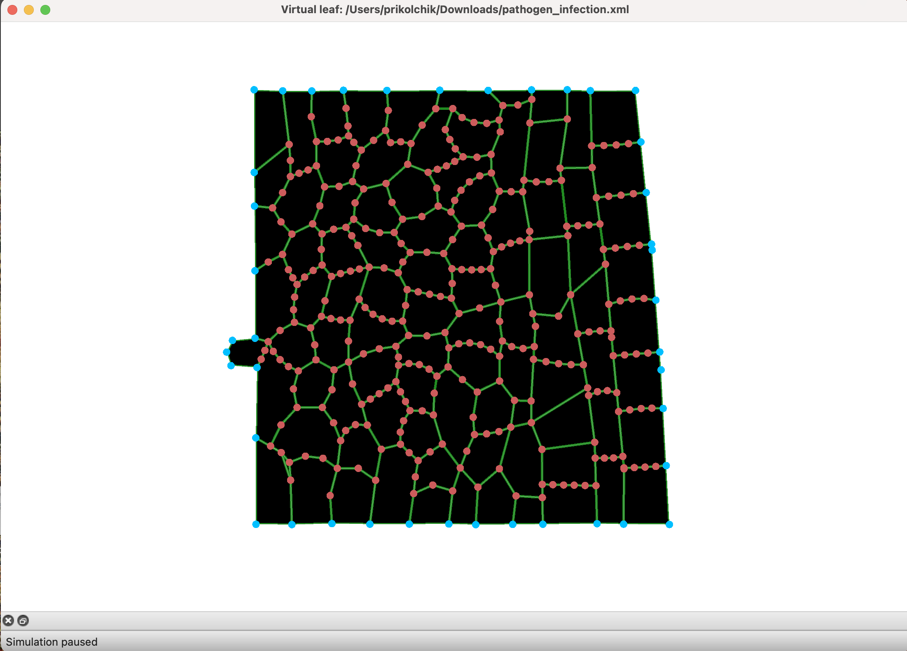
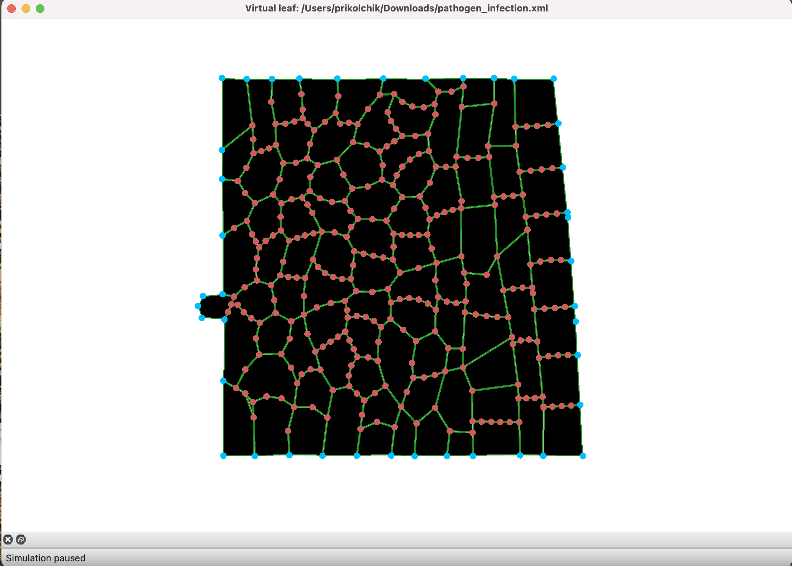
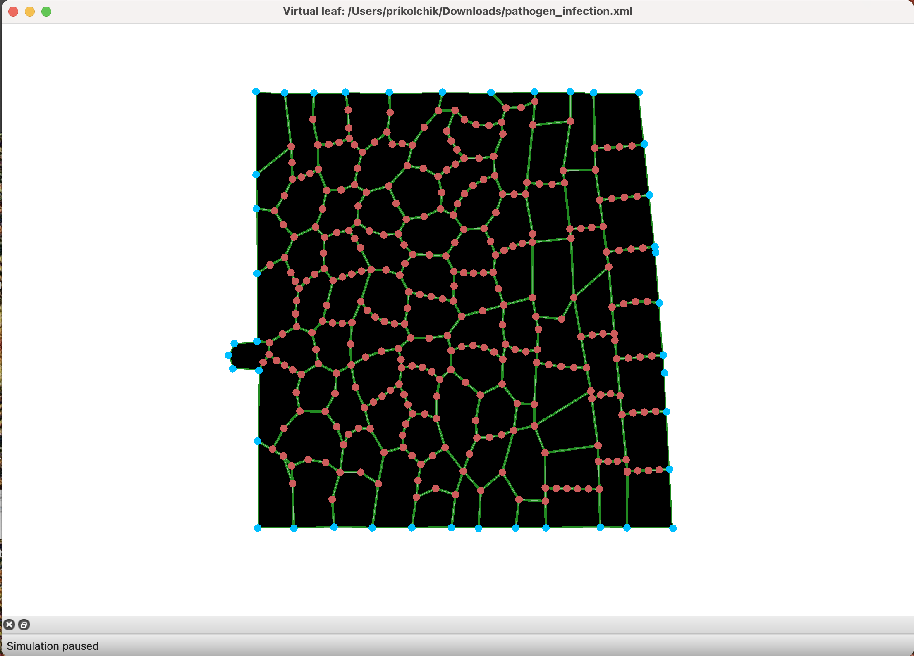
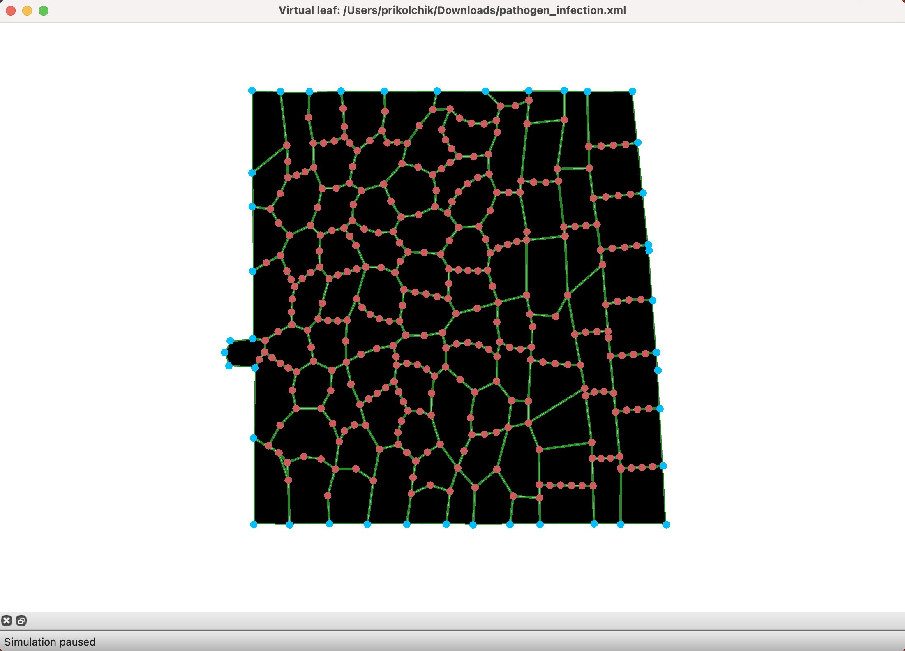

# Assignment 5. Plant Tissue Simulations

## 1. Pathogen infection simulation

### Initial state

!
### 30 min

### 60 min

### 90 min

### 120 min

### Description

Spread: In the very beginning, the tissue is highly ordered, with long and vertical cells with straight cell walls. During the simulation the cells progressively start to deform and spread from the initially affected region(in the center of the tissue) into surrounding tissues(closer to borders, left part of the tissue was changed the most). 
How the tissue deforms: cells close to this region change shape from rectangle shape to circle one first, then surrounding cells start to deform. Therefore, the tissue becomes less organized. Tissues in the left upper corner seem to be deformed the most, while cells in the right part seem to be more organized and cells have form of rectangles/squares.

## 2. Infection analysis

### How is a cell wall stiffness reduced as a function of chemical level?

The cell wall stiffness is reduced when level of the chemical 0 in a normal cell increases. First, we divide the chemical level by 0.5 and limit the result to 1.2. If this level is above 0.1, the wall stiffness is calculated as 3 - patho_chem_level. That means that a higher chemical level makes the wall softer(but stiffness never falls to 0).

### What does the pathogen do differently?

The pathogen cells are excluded from the chemical-dependent wall weakening. Their wall stiffness stays at the default value. But pathogen cells grow, they can divide and produce the chemical signal. This chemical then spreads to neighbouring cells and weakens their walls, that leads to tissue deformation.